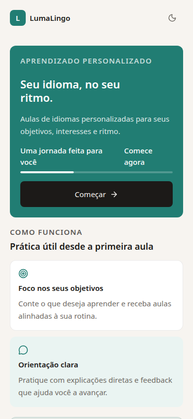
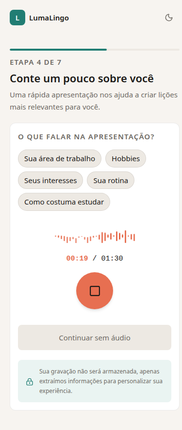

# LumaLingo

> Um app mobile-first de aprendizagem de idiomas que começa pela vida real da
> pessoa: objetivos, rotina, interesses e ponto de partida.

LumaLingo é um MVP de edtech com IA. A proposta é substituir uma experiência
genérica por uma jornada que coleta contexto de forma leve, estima o ponto de
partida do aluno e cria a base para próximas aulas personalizadas.

O projeto foi pensado como um case de produto e engenharia: uma interface
responsiva e acessível, regras pedagógicas explícitas, privacidade no fluxo de
voz e uma arquitetura de monorepo pronta para evoluir.

## A experiência

<p align="center">
  
  
</p>

As imagens mostram o layout em 390 × 844 px, com tema claro selecionado: a
landing page pública e a etapa real de gravação de áudio do onboarding.

### Do primeiro acesso à primeira prioridade de aprendizagem

1. A pessoa escolhe o idioma que fala e o idioma que quer aprender.
2. Define faixa etária, objetivo, preferências de estudo e ritmo.
3. Apresenta seu contexto por uma gravação curta ou por campos manuais.
4. Escolhe entre começar do zero ou fazer um diagnóstico inicial adaptado ao
   ponto de partida.
5. Revisa as informações e confirma o onboarding; o sistema persiste a
   primeira prioridade de aprendizagem.

O fluxo evita transformar a configuração em uma prova longa. Quem está
começando pode pular o diagnóstico; quem já tem algum repertório recebe uma
sequência curta de questões com rastreabilidade por competência.

## O que já existe

| Área           | Entrega atual                                                                                                                     |
| -------------- | --------------------------------------------------------------------------------------------------------------------------------- |
| Experiência    | Landing page, design system responsivo, temas claro e escuro, e rotas públicas e autenticadas.                                    |
| Onboarding     | Idiomas, dados de contexto, objetivos, preferências, ritmo, caminho iniciante ou diagnóstico, revisão e retomada do progresso.    |
| Personalização | Apresentação de áudio de até 90 segundos, extração assíncrona de perfil e alternativa manual para quem não quer gravar.           |
| Diagnóstico    | Banco de questões determinístico, registro de tentativas, pontuação e atualização inicial do estado de aprendizagem.              |
| Plataforma     | Sessão própria da aplicação após Cognito, API documentada com OpenAPI, persistência PostgreSQL/Prisma e infraestrutura Terraform. |
| Qualidade      | Testes unitários junto ao código e jornada crítica coberta com Playwright e uma API de teste em memória.                          |

## Diferenciais de produto e engenharia

- **Personalização com propósito:** interesses, trabalho, rotina e objetivos
  são dados de entrada para a experiência de aprendizagem, não apenas campos
  de perfil.
- **Privacidade desde o desenho:** o áudio da apresentação é processado em
  memória e não é persistido. Pessoas menores de 13 anos seguem o caminho
  manual, sem gravação.
- **Modelo pedagógico explícito:** conceitos, competências, pré-requisitos e
  evidências de aprendizagem são modelados separadamente. Isso permite
  evoluir a adaptação sem transformar regras de ensino em prompts opacos.
- **Arquitetura orientada a limites:** contratos compartilhados, schemas Zod,
  DTOs HTTP, serviços de domínio e adaptadores de infraestrutura ficam em
  camadas distintas.

## Stack

- **Frontend:** React, Vite, TypeScript, Tailwind CSS e Lucide.
- **Backend:** Fastify, TypeScript, Zod, cookies de sessão e OpenAPI.
- **Dados:** PostgreSQL, Prisma e modelos versionados para o catálogo
  pedagógico.
- **Integrações:** Amazon Cognito para login, Gemini para a extração do perfil
  a partir da apresentação, e adaptadores para isolar provedores.
- **Operação e qualidade:** pnpm workspaces, Vitest, Playwright, Pino e
  Terraform.

## Arquitetura do repositório

| Diretório                                | Responsabilidade                                                             |
| ---------------------------------------- | ---------------------------------------------------------------------------- |
| [`apps/web`](apps/web)                   | Aplicação React e a experiência mobile-first.                                |
| [`apps/api`](apps/api)                   | API Fastify, autenticação, onboarding, diagnóstico e regras de aplicação.    |
| [`packages/shared`](packages/shared)     | Contratos TypeScript e schemas reutilizados entre aplicações.                |
| [`packages/database`](packages/database) | Schema Prisma, migrations, importadores e validações do catálogo pedagógico. |
| [`infra`](infra)                         | Infraestrutura AWS declarada com Terraform.                                  |
| [`docs`](docs)                           | Decisões arquiteturais, estratégia de diagnóstico e documentação de produto. |

## Em evolução

O núcleo de entrada, diagnóstico e estado inicial de aprendizagem está em
desenvolvimento ativo. As próximas etapas de produto são gerar a primeira aula
guiada a partir dessas evidências, avaliar as respostas e fechar o ciclo com
um relatório que informa a próxima aula. Recursos de fala, gamificação e
funcionalidades sociais permanecem fora do escopo do MVP.

## Executar localmente

Pré-requisitos: Node.js 22+, pnpm 10 e um PostgreSQL acessível. Para o fluxo
de autenticação e extração de perfil, configure também Cognito e uma chave do
Gemini.

```bash
pnpm install
cp .env.example .env
pnpm dev
```

Preencha as variáveis indicadas em [`.env.example`](.env.example), em especial
as configurações do banco, Cognito e `GEMINI_API_KEY`.

### Verificações

```bash
pnpm check
pnpm test
pnpm test:e2e
pnpm format
```

Os testes end-to-end iniciam uma API e uma interface locais com um aluno de
teste em memória; não exigem banco de produção nem conta Cognito.

## Leitura complementar

- [Glossário de produto e domínio](CONTEXT.md)
- [Visão de produto e requisitos](luma-lingo-prd.md)
- [Ciclo de aprendizagem do aluno](docs/learner-learning-loop.md)
- [Estratégia de validação do diagnóstico](docs/initial-diagnostic-validation-strategy.md)
- [Decisões de arquitetura](docs/adr)
- [Diretrizes do design system](docs/design-system/guidelines.md)

---

LumaLingo está sendo construído como um produto de aprendizagem prático,
calmo e adaptável — com uma base técnica que torna as decisões de produto
auditáveis.
