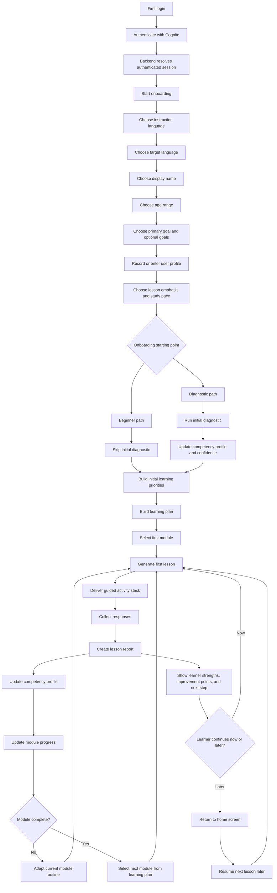
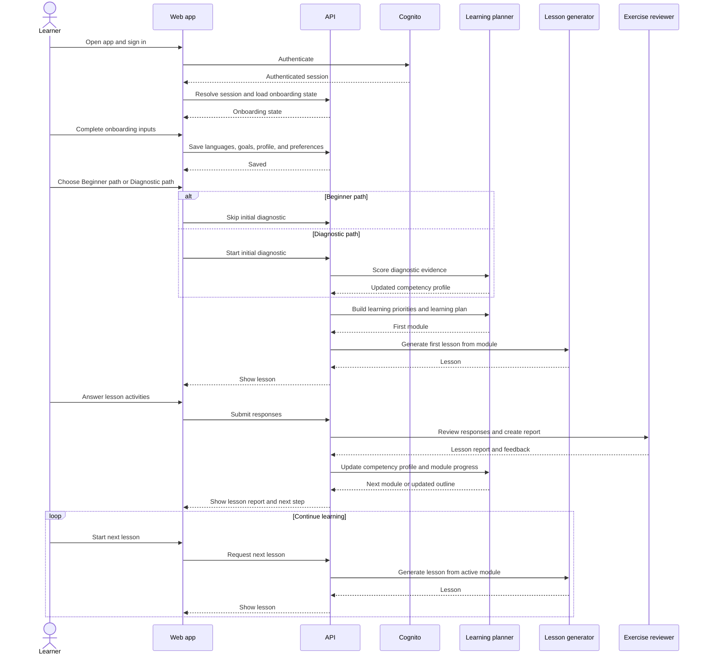

# Learner Learning Loop

This diagram shows the product flow from first login through onboarding, first lesson creation, and the repeated lesson loop.

## Notes

- `Beginner path` skips the initial diagnostic.
- `Diagnostic path` runs the initial diagnostic and seeds the first competency estimates.
- The `Learning plan` is revisable and points to the next `Module`.
- `Top mistakes` refine the active module outline instead of replacing the module objective.
- `Review points` are added lightly alongside the active module.

## Sequence View

